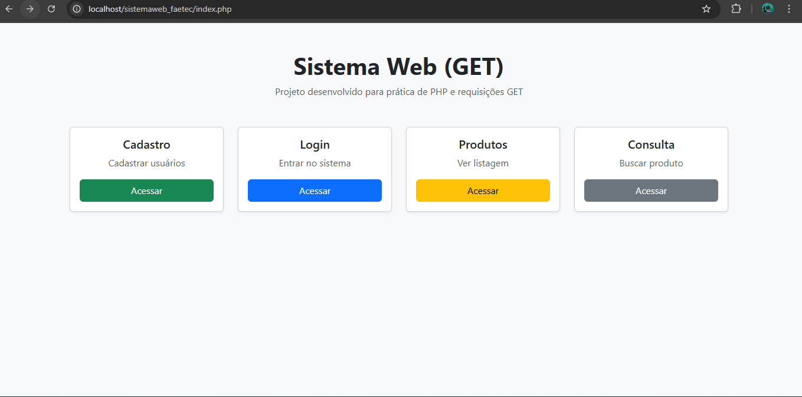
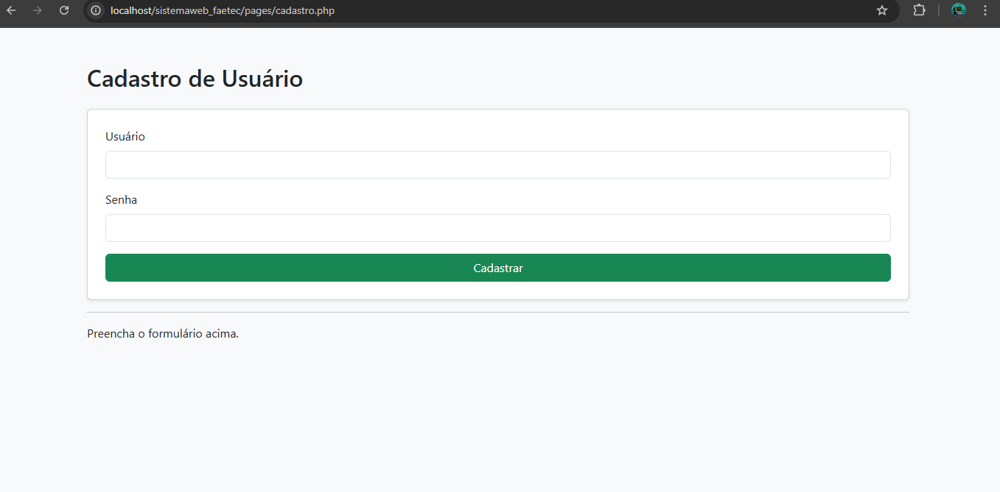
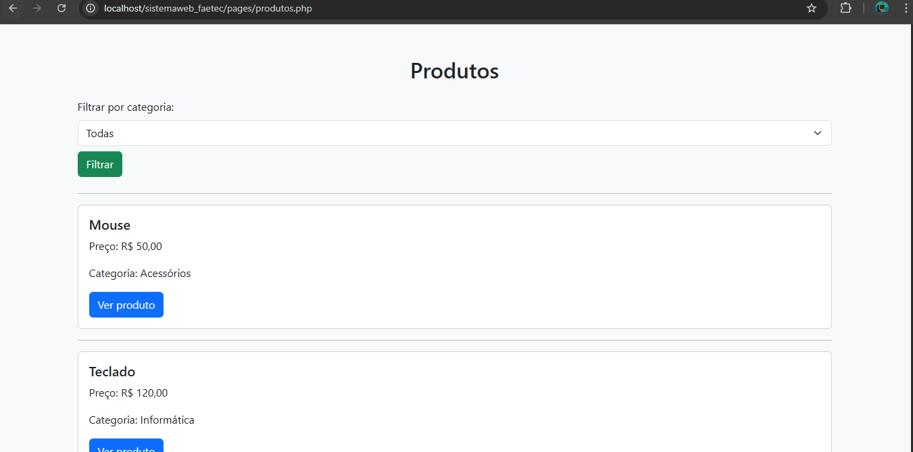
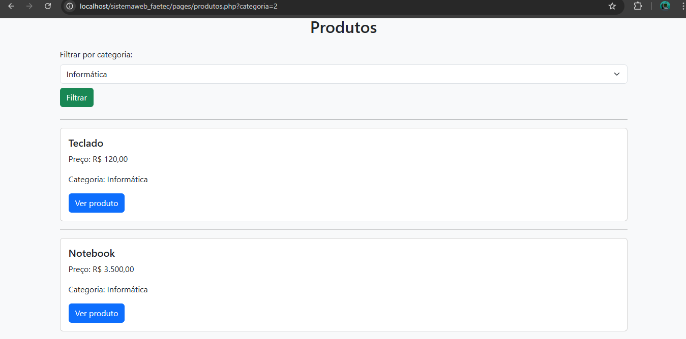
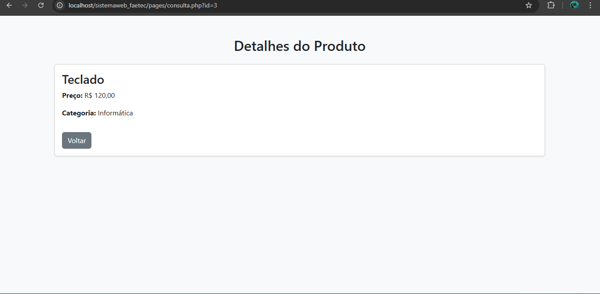

# 🛒 Sistema Web com PHP (Requisições GET)

## 📌 Sobre o projeto

Este projeto é um sistema web simples desenvolvido em PHP com o objetivo de praticar conceitos fundamentais de desenvolvimento backend, utilizando requisições do tipo **GET** para simular funcionalidades comuns de sistemas reais.

O sistema permite:

- Cadastro de usuários
- Login de usuários
- Listagem de produtos
- Consulta de produtos por ID ou nome
- Filtro por categoria
- Ordenação de produtos por preço

Os dados são simulados através de arrays em um arquivo separado, funcionando como um "banco de dados" local.

---

## 🖼️ Demonstração

### Tela inicial



### Tela cadastro



### Listagem de produtos



### Filtro por categoria



### Detalhes do produto



---

## 📚 Contexto acadêmico

Este projeto foi desenvolvido como parte dos estudos realizados na FAETEC (Fundação de Apoio à Escola Técnica do Estado do Rio de Janeiro), com o objetivo de aplicar na prática conceitos de desenvolvimento web utilizando PHP.

O desafio proposto consistia em evoluir um sistema simples utilizando requisições GET, implementando funcionalidades como filtro, busca e ordenação de dados.

---

## 🧩 Desafio proposto

### Requisitos do desafio:

1. Adicionar filtro por categoria

   ```
   produtos.php?categoria=2
   ```

2. Permitir busca por nome

   ```
   consulta.php?nome=Mouse
   ```

3. Ordenar produtos por preço

---

## 🚀 Funcionalidades implementadas

- 🔍 Filtro de produtos por categoria via GET
- 🔎 Busca de produto por nome ou ID
- 📊 Ordenação de produtos por preço utilizando `usort`
- 🔐 Simulação de login com validação de usuário e senha
- 👤 Cadastro de usuário via parâmetros GET
- 🔗 Navegação entre páginas (listagem → detalhe)
- 🧠 Tratamento de erros (produto não encontrado, parâmetros ausentes)
- 🛡️ Uso de `htmlspecialchars` para evitar problemas de segurança

---

## 🛠️ Tecnologias utilizadas

- PHP (estrutura e lógica do sistema)
- HTML (estrutura das páginas)
- CSS (estilização básica)
- Bootstrap (melhoria visual da interface)

---

## 📂 Estrutura do projeto

```
/projeto
│
├── index.php
├── cadastro.php
├── login.php
├── produtos.php
├── consulta.php
├── dados.php
└── /css
```

---

## ▶️ Como executar o projeto

Para rodar este projeto localmente, você pode utilizar um ambiente como o XAMPP.

### Passos:

1. Instale o XAMPP (ou outro servidor com Apache e PHP)
2. Coloque a pasta do projeto dentro de:

   ```
   C:\xampp\htdocs\
   ```

3. Inicie o Apache no painel do XAMPP
4. Acesse no navegador:

   ```
   http://localhost/nome-da-pasta-do-projeto
   ```

---

## 💡 Observações

- As funcionalidades utilizam requisições GET para fins didáticos
- Os dados são armazenados em arrays (não há banco de dados)
- O projeto foi desenvolvido com foco em aprendizado e prática

---

## 📈 Possíveis melhorias futuras

- Utilizar método POST para formulários
- Integrar com banco de dados (MySQL)
- Implementar autenticação com sessão
- Melhorar organização do código (MVC)
- Criar interface mais completa e responsiva

---

## 👨‍💻 Autor

Desenvolvido por Higor Rodrigues
Projeto com fins educacionais 🚀
